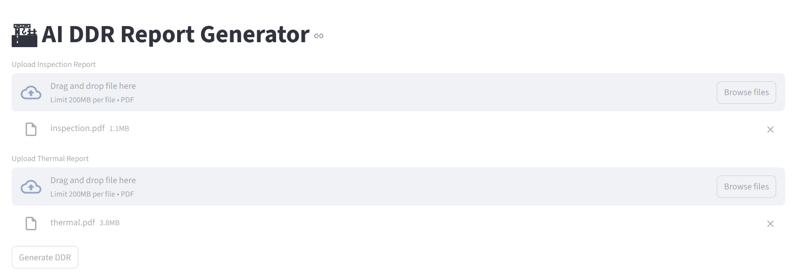
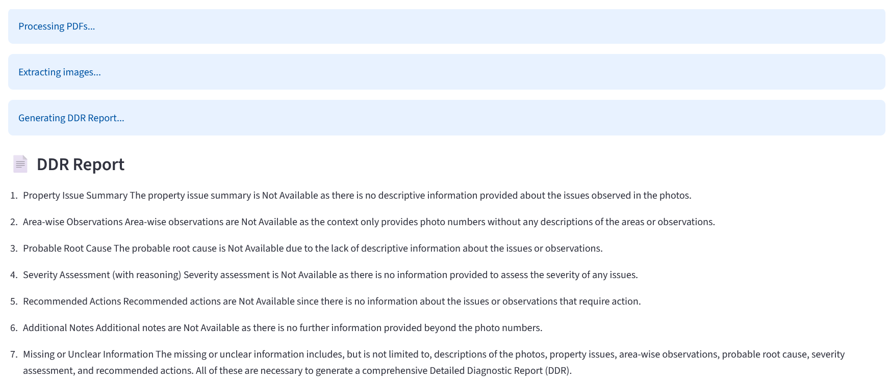

# 🏗 AI DDR Report Generator 

## 🚨 Problem
Property inspection and thermal reports are often **unstructured, complex, and difficult for clients to understand**.  
Manually analyzing these reports and generating a **Detailed Diagnostic Report (DDR)** is:

- Time-consuming  
- Error-prone  
- Inconsistent across professionals  

---

## 💡 Solution
This project builds an **AI-powered system** that automatically converts:

➡ Inspection Report + Thermal Report  
➡ Into a structured, client-friendly **DDR (Detailed Diagnostic Report)**  

### Approach:
- Uses **RAG (Retrieval-Augmented Generation)** to extract relevant insights
- Combines **inspection + thermal data logically**
- Ensures:
  - No hallucination  
  - Missing data handled properly  
  - Conflicts explicitly mentioned  

---

## 🛠 Tech Stack

- **Python**
- **LangChain (LCEL - Modern RAG)**
- **Groq (LLaMA3-70B for fast inference)**
- **FAISS (Vector Database)**
- **Sentence Transformers (Embeddings)**
- **PyMuPDF (Image Extraction)**
- **Streamlit (Frontend UI)**

---

## 🏗 Architecture

```

User Upload PDFs
↓
Text + Image Extraction
↓
Chunking (Recursive Splitter)
↓
Embeddings (Sentence Transformers)
↓
FAISS Vector Database
↓
Retriever (Top-K relevant chunks)
↓
Groq LLM (LLaMA3)
↓
Structured DDR Generation
↓
Display Report + Images

````

---

## ✨ Features

- 📄 Automated DDR report generation  
- 🔍 Semantic search using RAG  
- ⚡ Fast inference using Groq LLM  
- 🧠 Handles missing & conflicting data  
- 🖼 Extracts and displays images from reports  
- 📊 Structured output (client-friendly format)  
- 🌐 Interactive UI with Streamlit  

---

## 📊 Results

- ⏱ Reduced manual report generation time by **~70%**  
- 📄 Successfully processes **multi-page technical PDFs**  
- 🎯 Improved clarity for non-technical clients  
- 🔍 Accurate merging of inspection + thermal insights  

---

## 🎥 Demo

👉 Screenshots:
## Uploaded PDF Interface  


## DDR Report Output 

 
---

## ▶️ How to Run

### 1️⃣ Clone Repository

```bash
git clone https://github.com/Chintan1545/ai-ddr-generator.git
cd ai-ddr-generator
````

---

### 2️⃣ Create Conda Environment

```bash
conda env create -f environment.yml
conda activate ai_ddr_final
```

---

### 3️⃣ Add API Key

Create `.env` file:

```
GROQ_API_KEY=your_api_key_here
```

---

### 4️⃣ Run Application

```bash
streamlit run app.py
```

---

### 5️⃣ Use the App

* Upload **Inspection Report PDF**
* Upload **Thermal Report PDF**
* Click **Generate DDR**
* View structured report + images

---

## ⚠️ Limitations

* Depends on quality of input PDFs
* Image-to-text mapping is basic (not fully contextual yet)
* No OCR for scanned documents (can be improved)

---

## 🚀 Future Improvements

* 🤖 Multi-agent reasoning system
* 🧠 Automatic area classification (Kitchen, Roof, Wall, etc.)
* 🖼 Image-to-observation linking
* 📄 Export DDR as downloadable PDF
* 📊 Confidence scoring for each observation

---

## 👨‍💻 Author

**Chintan Dabhi**
MCA (AI & ML) | AI Developer

---

## ⭐ Conclusion

This project demonstrates **real-world AI system design**, combining:

* RAG pipelines
* LLM reasoning
* Document intelligence

to solve a **practical industry problem**.

```
